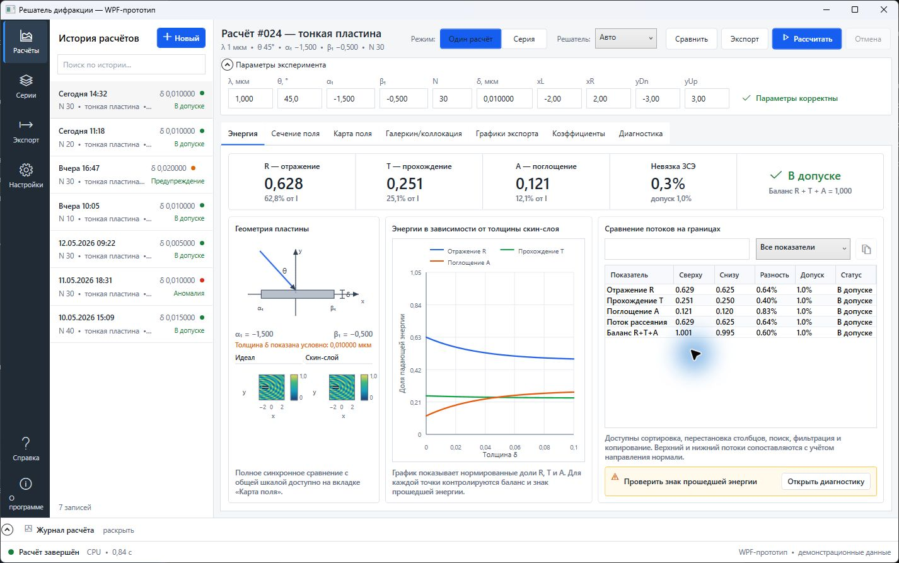
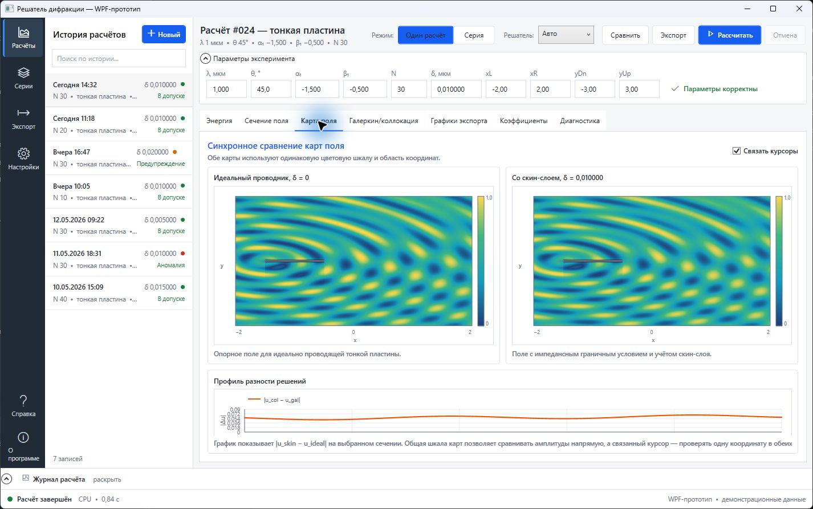

# WPF-прототип интерфейса

Черновой интерфейс объединяет выбранный макет с идеями из остальных вариантов. Текущий WinForms-проект не изменён: прототип добавлен в решение отдельным проектом `Diffraction.WpfPrototype`.

## Запуск

При открытии `Diffraction.sln` общий профиль `WPF Prototype` запускает этот проект по `F5` или `Ctrl+F5`.

```powershell
dotnet run --project Diffraction.WpfPrototype
```

Требуются Windows и .NET 10 SDK.

## Что реализовано

- навигационная панель, поиск по истории и создание нового запуска;
- полный снимок параметров в истории: выбор одиночного расчёта или серии восстанавливает режим, backend, геометрию, область вывода и диапазоны;
- ручной ввод исходных параметров, переключение одиночного расчёта и серии;
- все исходные вкладки результатов плюс приоритетная вкладка «Энергия»;
- сводка `R_scat`, `T_scat`, `A_J`, невязки ЗСЭ и сравнение физически совместимых пар;
- контрольные графики по толщине скин-слоя и углу падения;
- сортируемые таблицы с поиском, фильтрацией и копированием;
- синхронное сравнение двух карт поля с общей шкалой и связанным курсором;
- геометрия пластины с визуально увеличенной толщиной и точным значением `δ`;
- выдвижной вверх журнал, строка состояния и индикатор этапов расчёта;
- заполненные разделы «Справка» и «О программе».





## Граница прототипа

Ход расчёта сейчас демонстрационный. Проект не вызывает `Diffraction.Core` и CUDA-модуль при нажатии кнопки, поэтому изменение полей ещё не пересчитывает результат. История хранит независимые снимки входных параметров только в памяти процесса; редактирование восстановленной формы не изменяет сохранённую запись.

Энергетические значения больше не являются произвольными: единый эталонный набор сформирован рабочим `Diffraction.Core` для одной пластины `[-1,5; -0,5]`, `λ=1`, `θ=45°`, `N=30`. Карточки, таблица и графики используют этот набор через `ValidatedEnergyDemo`; `R_scat` и `T_scat` совпадают и уменьшаются вместе. Подключение расчётного ядра следует выполнять через отдельный слой представления, сохранив WinForms как рабочую версию до интеграционной проверки.

Результаты проверки находятся в [testing-report.md](testing-report.md), визуальное сравнение — в [design-qa.md](design-qa.md).
