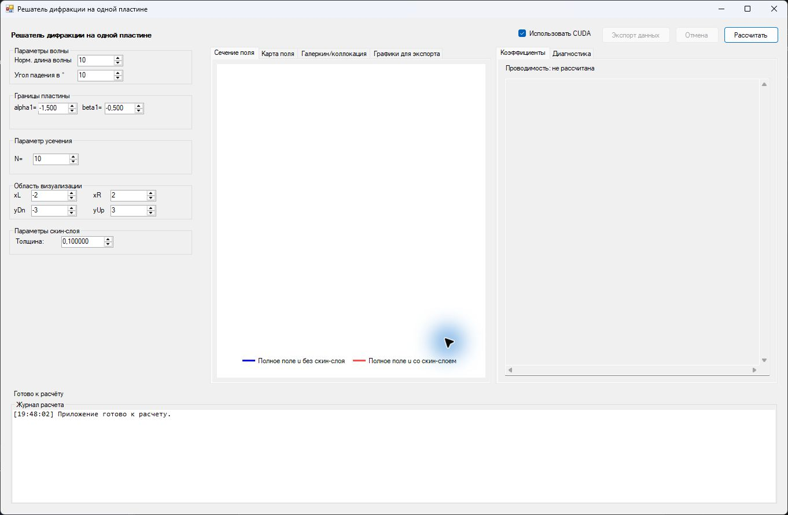
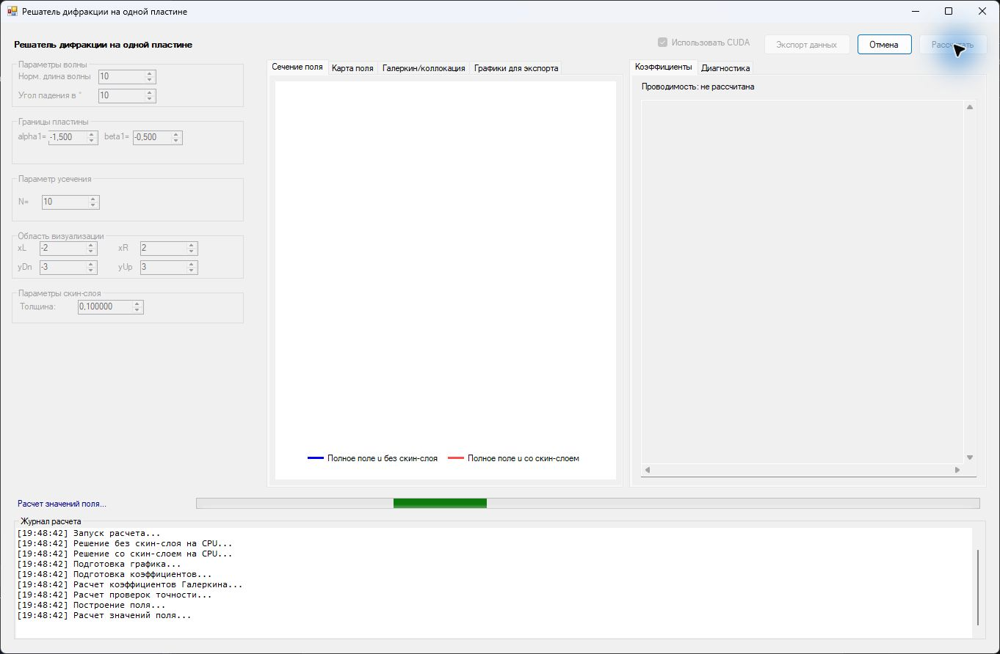
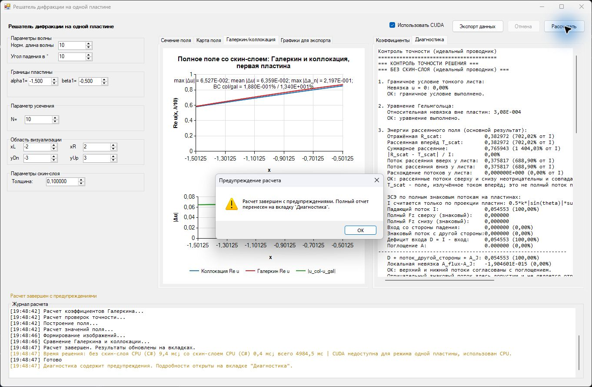
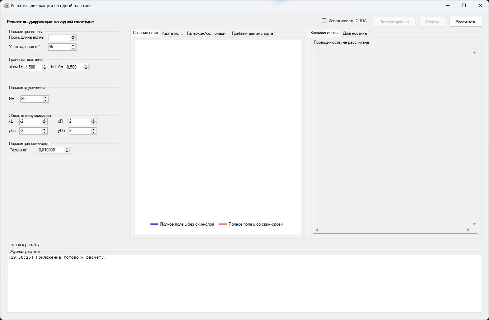
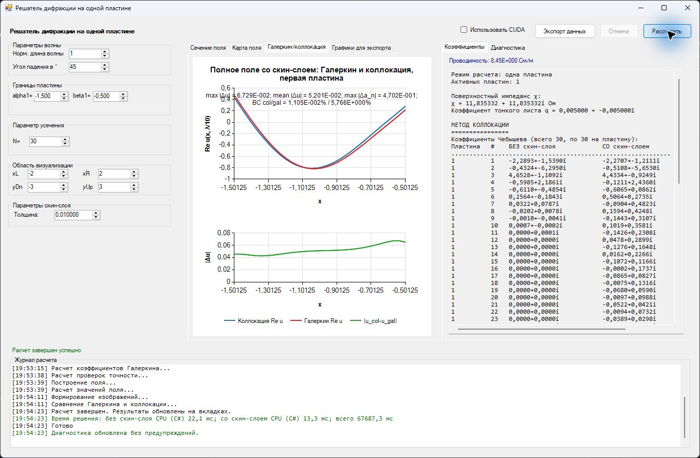
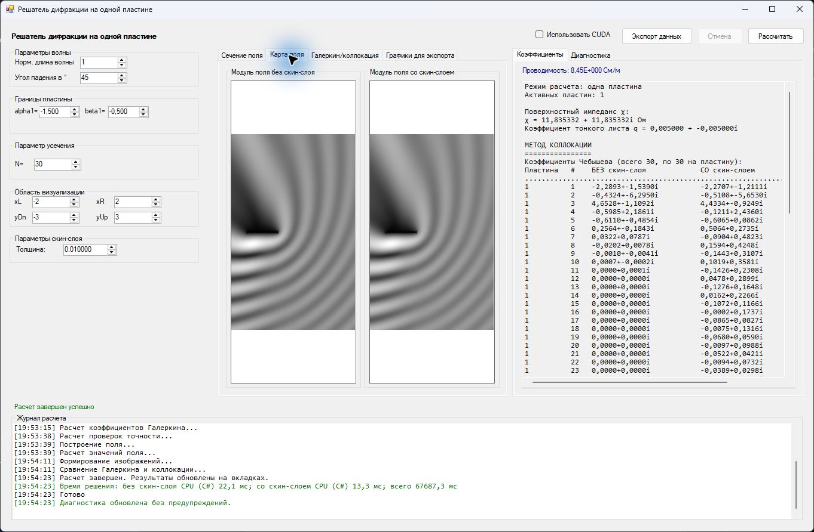
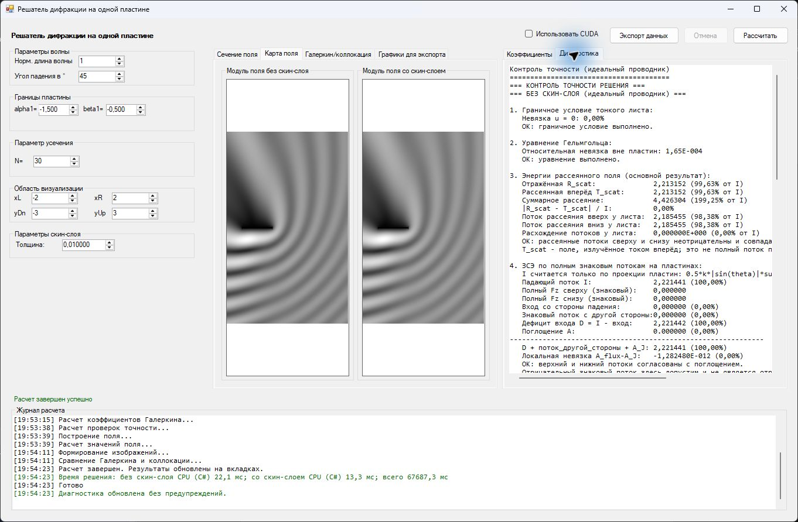
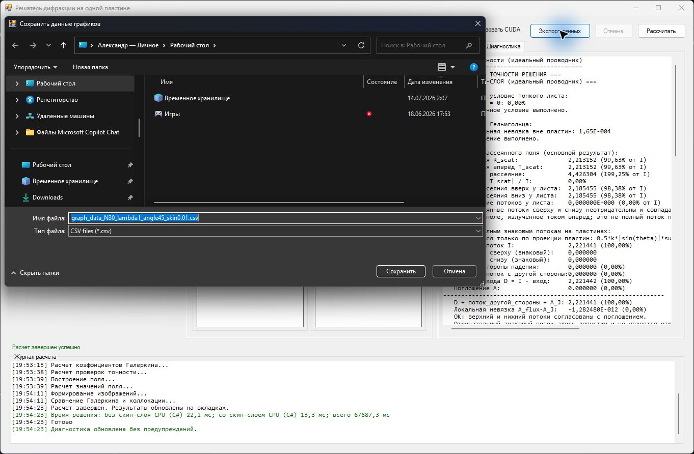

# Аудит интерфейса решателя дифракции

Дата: 2 августа 2026 года

Область: текущий WinForms-интерфейс режима одной тонкой плоской пластины

Цель пользователя: задать физические и численные параметры, запустить расчет, проверить энергетический баланс и потоки сверху/снизу, сравнить решения и сохранить воспроизводимый результат.

## Краткий вывод

Интерфейс уже поддерживает полный базовый сценарий и корректно блокирует параметры во время расчета, показывает этапы, позволяет отменить операцию и экспортировать CSV. Основные проблемы связаны не с оформлением, а с приоритетами информации и поведением:

1. По умолчанию включена CUDA, хотя активный режим одной пластины ее не поддерживает. Пользователь получает предупреждение только после запуска.
2. Главные для исследования показатели энергии и ЗСЭ спрятаны в длинном текстовом отчете, тогда как центральное место занимают графики и коэффициенты.
3. Карта поля и сравнение методов строятся обязательно. В контрольном расчете при `N=30` численные решения заняли около `22,1 + 13,3 мс`, а весь сценарий — около `67 687 мс`.
4. Предупреждение одновременно показывается в строке состояния, журнале, диагностике и блокирующем модальном окне.
5. Диагностика и коэффициенты представлены как неструктурированный моноширинный текст; значимые строки обрезаются по ширине.

Рекомендуемое направление: сначала провести короткий UX-рефакторинг WinForms и отделить представление от расчета. Переход на WPF оправдан, только если приложение будет развиваться дальше: появятся серии расчетов, сравнение запусков, несколько режимов пластин и полноценная визуализация. Полная одномоментная перепись сейчас нецелесообразна.

## Проверенный сценарий

### 1. Старт и ввод параметров — требуется улучшение

- Сильная сторона: все параметры видны без переходов между окнами.
- Центральная и правая области до первого расчета почти пусты и не помогают проверить геометрию.
- Заголовок приложения повторяется в системной строке окна и внутри панели.
- Нижний журнал постоянно занимает `210 px`, хотя до расчета содержит одну строку.
- `CUDA` включена заранее, но текущий режим жестко задан как `SinglePlate` в `Form1.cs:21`; значение по умолчанию задано в `Form1.Designer.cs:574`.
- Обозначения `alpha1`, `beta1`, `xL`, `yDn`, `skin` понятны разработчику, но не объясняют физический смысл, единицы и допустимый диапазон.

### 2. Расчет — в целом хорошо, но нет оценки времени

- Сильная сторона: параметры блокируются, кнопка отмены активируется, текущий этап и журнал обновляются.
- Индикатор неопределенный и не показывает ни общий прогресс, ни ожидаемую длительность.
- Журнал дублирует строку состояния почти на каждом этапе.
- Нельзя отличить обязательный численный расчет от дорогого построения поля и сравнения методов.

### 3. Завершение с предупреждением — требуется улучшение

- Приложение уже открыло вкладку диагностики, изменило статус и добавило запись в журнал, но затем блокирует работу еще одним окном.
- При недоступной CUDA происходит скрытый переход на CPU. Это корректная техническая страховка, но неверный сценарий выбора вычислителя.
- Предупреждения разного уровня важности не разделены: ограничение backend, погрешность ЗСЭ и физически подозрительные значения выглядят одинаково.

### 4. Настроенный контрольный запуск — требуется улучшение

- Введенные значения не формируют читаемое резюме эксперимента.
- Нет сохраненных наборов, истории запусков и команды повторить/сравнить расчет.
- Пользователь не видит, где находится пластина относительно выбранной области визуализации.

### 5. Успешный результат — смешанное состояние

- Сильная сторона: результат, коэффициенты, время и журнал доступны в одном окне.
- После расчета автоматически открывается сравнение Галеркина и коллокации, хотя основной вопрос пользователя связан с энергиями и ЗСЭ.
- Ключевые показатели `R`, `T`, поглощение, невязка ЗСЭ и потоки сверху/снизу не представлены как краткое резюме.
- Коэффициенты невозможно быстро фильтровать, сортировать, копировать по строкам или сопоставлять между методами.
- Контрольный запуск показал, что большая часть времени уходит не на решатель, а на обязательные вторичные представления.

### 6. Карта поля — требуется улучшение

- Изображения занимают узкую горизонтальную полосу внутри высоких областей просмотра.
- Нет осей, делений, единиц, цветовой шкалы и числового диапазона.
- Обе карты нормируются независимо по своему максимуму, поэтому одинаковый серый цвет не означает одинаковую амплитуду. Визуальное сравнение «без/со скин-слоем» может вводить в заблуждение.
- Положение пластины обозначено слабо; нет масштабирования, панорамирования, координат курсора и экспорта изображения.

### 7. Диагностика — требуется улучшение

- Сильная сторона: отчет содержит необходимые подробности и уже формируется отдельным компонентом `EnergyDiagnosticsReportBuilder`.
- Текст не переносится (`Form1.cs:328`), поэтому длинные строки требуют горизонтальной прокрутки.
- Все значения имеют одинаковый визуальный вес; ошибки, допуски и справочные параметры трудно сравнивать.
- Пары «верх/низ», энергетический баланс и предупреждения следует выводить таблицами с абсолютной и относительной разностью.

### 8. Экспорт — приемлемо, но неполно

- Сильная сторона: имя CSV включает `N`, длину волны, угол и толщину скин-слоя.
- Экспортируется только CSV графиков; отсутствуют снимок входных параметров, диагностика, изображения, версия вычислителя и итоговый отчет.
- Термины «Экспорт данных» и «Сохранить данные графиков» расходятся.

## Приоритетные проблемы

| Приоритет | Проблема | Риск | Рекомендация |
|---|---|---|---|
| P0 | CUDA включена в неподдерживаемом режиме | Ложное ожидание ускорения и предупреждение после ожидания | Выбор `Авто / CPU / CUDA`; недоступный вариант блокировать до запуска с краткой причиной |
| P0 | Энергетические показатели спрятаны | Пользователь пропускает главный критерий корректности | Сделать «Энергия» первой вкладкой и показать `R`, `T`, `A`, невязку ЗСЭ, потоки сверху/снизу |
| P0 | Дорогие вторичные расчеты выполняются всегда | Отклик порядка минуты при решении порядка миллисекунд | Сначала вернуть базовый результат; поле и сравнение методов строить по запросу и кэшировать |
| P1 | Модальные предупреждения дублируют интерфейс | Прерывание анализа серии запусков | Неблокирующая панель результата с количеством предупреждений и ссылкой «Открыть диагностику» |
| P1 | Карты нельзя честно сравнить | Ошибочная визуальная интерпретация | Общая шкала, палитра, оси, легенда, диапазон и переключатель общей/локальной нормировки |
| P1 | Диагностика — длинный текст | Высокая стоимость поиска и сравнения | Сводка + таблицы; полный текст оставить во вкладке «Подробности» |
| P1 | Нет серии расчетов | Ручная проверка зависимости от скин-слоя | Режим sweep: диапазон, шаг, графики энергий/невязки, таблица аномалий |
| P2 | Фиксированный минимум `1220x780` | Плохая работа на небольших экранах и при увеличенном масштабе | Перестраиваемая сетка, сворачиваемые панели, проверка 125/150/200% DPI |

## Предлагаемая структура экрана

### Верхняя панель

- Режим: `Одна пластина / Две пластины`.
- Вычислитель: `Авто / CPU / CUDA` с состоянием доступности.
- Команды: `Рассчитать`, `Отменить`, меню экспорта.
- Краткий статус этапа и полное время.

### Левая панель параметров

- Разделы: `Геометрия`, `Падающая волна`, `Численный метод`, `Визуализация`.
- Читаемые подписи рядом с обозначением: `Левая граница пластины, α₁`, `Угол падения, °`, `Толщина скин-слоя`.
- Единицы, подсказки и валидация рядом с полем, а не после запуска.
- Небольшая схема пластины и области наблюдения, обновляемая при вводе.
- Пресеты: быстрый контроль, контроль преподавателя, пользовательский набор.

### Центральная рабочая область

Первой должна быть вкладка `Энергия`, а не график метода:

- компактная строка итогов: отражение, прохождение, поглощение, невязка ЗСЭ;
- отдельная таблица потоков сверху/снизу: значение, знак, модуль разности, относительная разность, допуск;
- явный знак направления потока и пояснение принятой ориентации нормали;
- предупреждения рядом с показателем, который их вызвал;
- вкладки `Энергия`, `Поле`, `Сравнение методов`, `Коэффициенты`, `Диагностика`.

### Нижняя область

- Журнал сделать сворачиваемой панелью, закрытой по умолчанию.
- В строке состояния оставить только текущий этап, длительность и число предупреждений.
- Для серии расчетов показывать очередь и возможность отменить текущий или весь sweep.

## Режим анализа толщины скин-слоя

Это наиболее полезное функциональное улучшение для текущей исследовательской задачи:

1. Пользователь задает начало, конец, шаг или число точек.
2. Перед запуском отображается число расчетов и приблизительная стоимость.
3. По мере выполнения строятся `R(skin)`, `T(skin)`, `A(skin)`, невязка ЗСЭ и разность потоков сверху/снизу.
4. Отрицательные энергии и превышение допуска помечаются как аномалии, но не скрываются и не заменяются модулем.
5. Клик по точке открывает входные параметры, полный отчет и поля конкретного запуска.
6. Экспорт сохраняет единый пакет: CSV/JSON, графики PNG или SVG, текстовый отчет и метаданные версии.

## Оптимизация отклика

1. Разделить конвейер на `решение -> энергетическая сводка -> дополнительные представления`.
2. Показывать сводку сразу после первых двух решений без/со скин-слоем.
3. Поле строить по запросу: сначала превью меньшего разрешения, затем точное изображение.
4. Профилировать вычисление значений поля в `Form1.cs:1710`: оно проходит по каждому пикселю двух карт и вызывает решение поля для каждой точки.
5. Кэшировать результаты по хэшу входных параметров и версии алгоритма.
6. Сравнение Галеркина и коллокации запускать только при открытии вкладки или по отдельной команде.
7. Для коэффициентов использовать виртуализированную таблицу; не создавать тысячи элементов доступности для точек графика.
8. Добавить измерение времени каждого этапа и выводить его в диагностике, чтобы точно разделить стоимость поля, сравнения методов и формирования отчета.

## Доступность и клавиатура

Проверка проводилась по визуальному состоянию и дереву доступности Windows; это не сертификация соответствия WCAG.

- У большинства полей есть связанная подпись, но у контейнера результатов имя доступности отображается как `вкладка beta2=`, а `xL/yDn` сопоставляются непоследовательно.
- В коде не найдены явные `AccessibleName`, `AccessibleDescription` и `ToolTip` для динамически создаваемых элементов.
- Графики публикуют очень большое число точек в дереве доступности, что создает шум для вспомогательных технологий.
- Размер текста и кнопок мал для длительной работы и увеличенного масштаба Windows.
- Следует проверить порядок `Tab`, видимый фокус, активацию `Enter/Space`, высокую контрастность и масштаб 200%.
- Цвет не должен быть единственным признаком состояния; сохранять текст/иконку `успешно`, `предупреждение`, `ошибка`.

## Решение о WPF

WPF подходит для этого приложения, потому что дает привязку данных, команды, стили, шаблоны и независимую от разрешения векторную компоновку. Это упростит динамические состояния расчета, валидацию, таблицы, темы и тестируемые ViewModel. Эти возможности описаны в официальных материалах Microsoft: [обзор WPF](https://learn.microsoft.com/en-us/dotnet/desktop/wpf/overview/) и [привязка данных WPF](https://learn.microsoft.com/en-us/dotnet/desktop/WPF/data/). Для MVVM можно использовать поддерживаемый Microsoft [CommunityToolkit.Mvvm](https://learn.microsoft.com/en-us/dotnet/communitytoolkit/mvvm/).

Перенос не ускорит численный расчет сам по себе и потребует заново проверить графики, карты, DPI, доступность и экспорт. Текущий проект использует .NET Framework 4.7.2 и `System.Windows.Forms.DataVisualization`; поэтому разумнее переносить оболочку поэтапно, сохранив `Diffraction.Core` и существующие тесты.

| Вариант | Оценка | Польза | Риск | Решение |
|---|---:|---|---|---|
| UX-рефакторинг WinForms | 3–6 рабочих дней | Быстро устраняет основные ошибки сценария | Низкий | Сделать сейчас |
| Новая WPF-оболочка поверх Core | 2–4 недели | MVVM, масштабирование, удобное развитие sweep и результатов | Средний | Делать при продолжении проекта |
| Полная перепись приложения | 4–8 недель и более | Максимальная свобода | Высокий, без выгоды для математики | Не рекомендуется |

### Безопасная последовательность переноса

1. Исправить CUDA по умолчанию, предупреждения, основную вкладку энергии и ленивые представления в WinForms.
2. Вынести из `MainForm` сервис расчета, модели состояния, команды и DTO результата. Сейчас `Form1.cs` содержит около 1900 строк и соединяет компоновку, управление расчетом, изображения, экспорт и сообщения.
3. Добавить ViewModel независимо от UI; ее можно подключить к текущей форме через адаптер.
4. Создать WPF-оболочку на современном .NET, переиспользовать `Diffraction.Core` и тестовые сценарии.
5. Временно разместить существующие WinForms-графики через `WindowsFormsHost`, затем заменить их после стабилизации сценариев.
6. Провести визуальные, клавиатурные, DPI- и производительные тесты до отказа от старой формы.

## План работ

### Сначала

- Исправить выбор вычислителя и убрать невозможный CUDA-сценарий.
- Добавить первую вкладку `Энергия` с ЗСЭ и потоками сверху/снизу.
- Отложить карту поля и сравнение методов до запроса пользователя.
- Заменить модальное предупреждение неблокирующей сводкой.
- Сделать журнал сворачиваемым, а диагностику — переносимой и структурированной.

### Затем

- Реализовать sweep по толщине скин-слоя и таблицу аномалий.
- Добавить пресеты, историю и сравнение запусков.
- Добавить общую шкалу карт поля, оси, координаты курсора и экспорт пакета результатов.
- Зафиксировать бюджет производительности по этапам.

### После стабилизации

- Принять решение о WPF на основе планов развития, а не только внешнего вида.
- При положительном решении переносить оболочку поэтапно, сохраняя численное ядро и контрольные тесты.

## Ограничения аудита

- Проверено одно разрешение окна около `1362x892` и два набора параметров.
- Не проверялись сенсорный ввод, экранный диктор в полном сценарии и все уровни DPI.
- Оценки сроков ориентировочные и требуют уточнения после выбора библиотеки графиков и формата будущего sweep.
- Аудит оценивает представление и сценарий; он не подтверждает физическую корректность полученных энергий.
